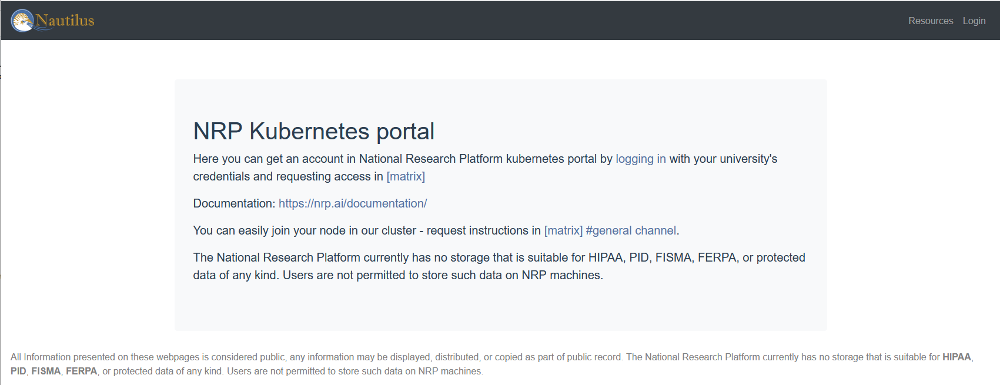
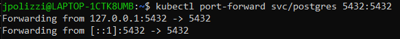
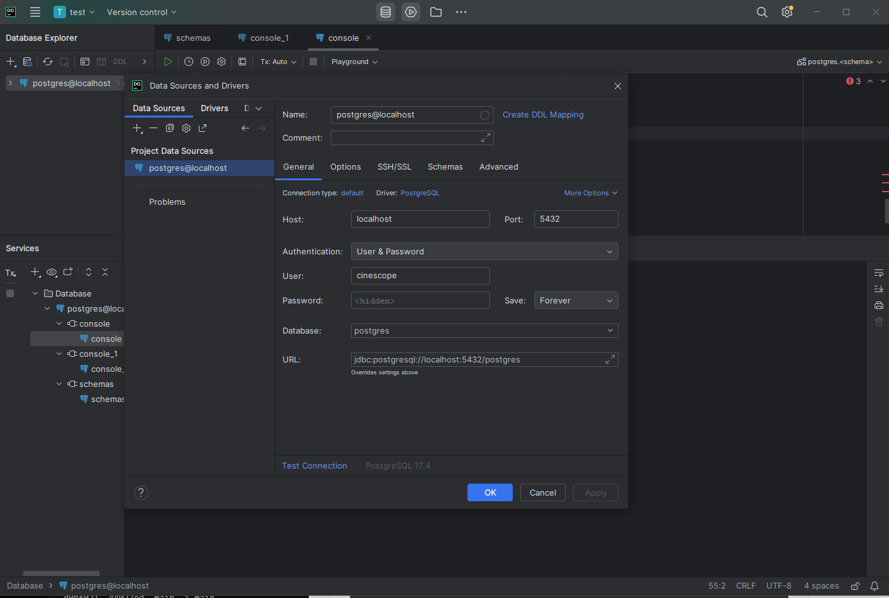
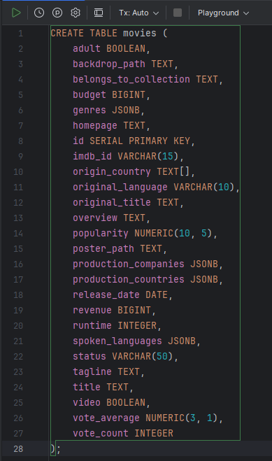
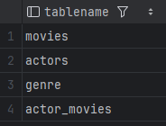
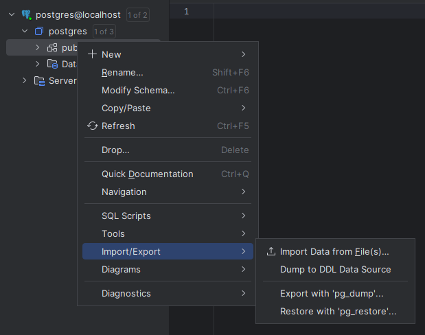
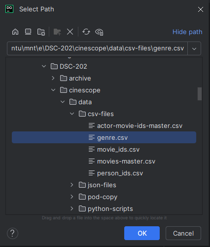
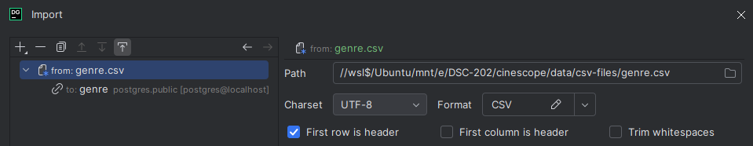
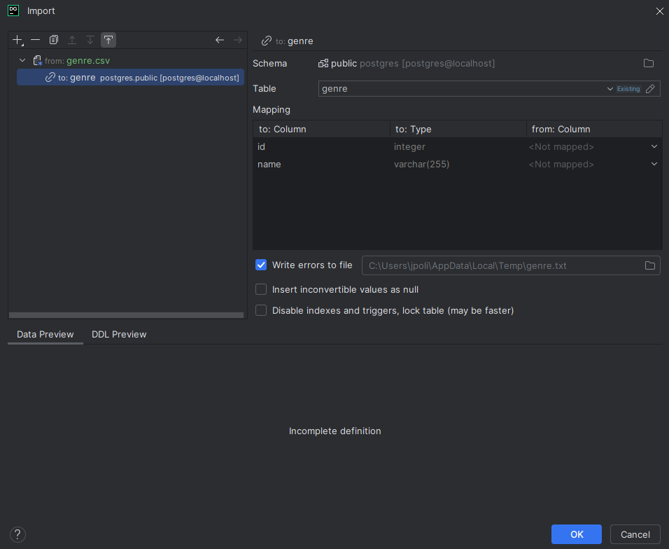
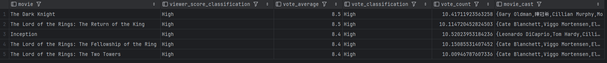

# DSC-202 Winter '25 - Presentation Recording AVAILABLE ON YOUTUBE: https://youtu.be/NDJGx8TrAh8  and Slides available above.
## Cinescope: TMDB Relational Genre Viewer 
## Created by: Joel Polizzi, Dongting Cai, Xuanwen Hua
### Featuring Verticle and Horizontal Scaling, Postgres, Neo4J, and Redis on the Nautilus Kubernetes Platform
### Cinescope can be viewed publically (until 3/30) at https://cinescope.nrp-nautilus.io


TMDB (The Movie Database) provides a rich database suitible for relational querying. The Cinescope project has developed a development to production pipeline to do relational searching in Postgres and Neo4J utilizing data from TMDB. Furthermore, Cinescope experiments with verticle and horizontal scalling of software services and databases and has been deployed in a highly reproducible way: leveraging cloud-native infrastructure and storing our infrastructure deployments in YAML files.

#### Follow the instructions will guide you through deploying cinescope on your own. 
#### The Cinescope instructions are intended to be ran in a Linux environment. If you wish to deploy on Windows or Mac, you may do so however the project was developed in Linux and the documentation is Linux specific. If you proceed outside of a linux environment then to the best of my knowledge the only difference will be in the installation instructions of Git and Git-Lfs.

## Table of Contents
- [Requirements](#requirements)
- [Postgres Deployment and Connection](#postgres)
- [Connecting from external services](#external_connections)
- [Front-end Access](#live)
- [Project Report](#project-report)
- [Slides](#Slides)

## Requirements
1)  Nautilus login
2)  Git package installation
3)  Git-lfs
5)  Local Install of DataGrip
6)  You need to ensure that you can access your local ports 5432, 7474, 7687, and 8888

## Nautilus Access
Nautilus is the platform we deployed Cinescope on. Access is available to UCSD students and staff. 
To gain access follow this link and login with your University provider:
https://portal.nrp-nautilus.io/

Once you gain access you will need to create a .kube directory in your home directory and then copy your kubernetes config file to the .kube directory.

```
mkdir ~/.kube && chmod 755 ~/.kube
# Copy the downloaded config file from your Download location to the .kube directory
cp /mnt/c/Users/jpoli/Downloads/config ~/.kube
chmod 755 ~/.kube/config

#export your KUBECONFIG variabl
export KUBECONFIG=~/.kube/config
```
Test that you have access to the cluster
```
kubectl get po
```

## Installing Git and Git-LFS
Ubuntu Linux:
```
sudo apt-get update && sudo apt-get install git git-lfs -y
```

Windows and Mac:
https://git-scm.com/downloads

* optionally you may download the repo without git using the interface download link

### The code base contains all the datasets, deployemnts, and code you will need to run Cinescope
```
# Clone down our repository and enter the top of the tree
git clone https://github.com/DSC-202-Cinescope/cinescope.git
cd cinescope
```
## Postgres
```
# Deploy the CephFS Postgres PVC (Persistent Volume Claim) - 20GB
kubectl create -f infra/ceph-postgres-pvc.yaml

# Deploy the Postgres Service and the Postgres Application
kubectl apply -f infra/postgres/postgres.yaml

# Once the deployemnt is running you can port-forward to connect with DataGrip
kubectl port-forward svc/postgres 5432:5432
```
You will see the ports connected from the remote service of the pod to your local port.


### 1) Connect DataGrip
As with any other new instance of DataGrip we will create a new Database and connect with the following parameters
- Host: localhost
- port: 5432
- User: cinescope
- password: cine$c0pe
- database: postgres

Datagrip will now connect to the remote database and we can proceed with adding our Schema tables and test queries.

### 2) Upload Schema from cinescope/schema/movie-schema.sql 
You may run the sql file in datagrip by following the instructions at https://www.jetbrains.com/help/datagrip/run-sql-files.html#run-sql-file-for-several-data-sources

Alternativly, it is easier to copy and past the movie-schema.sql content into anew query window and run the table creation

Select the first table in the window and execute the query


You will repeat this process for all tables. 
In total you will have 4 tables created.
You can check the created tables with:
```
SELECT tablename
FROM pg_catalog.pg_tables
WHERE schemaname = 'public';
```
You will have the following output if everything has been properly created



### 3)  Upload the Datasets to Postgres
To upload the data to the database we will proceed with using DataGrip for simplicity
There are 4 .csv files that we will upload to Postgres
- data/csv-files/genre.csv
- data/csv-files/person\_ids.csv
- data/csv-files/movies-master.csv
- data/csv-files/actor-movie-ids-master.csv

** Please note: movie-master.csv contains ~1.6 million entries and actor-movie-ids-master.csv contains nearly 6 million entries. These both will take a long time to upload to postgres. This took me over a full day to import the data.

In datagrip you will load the datasets by Right Clicking on the database public directory, then selecting 'Import/Export', then 'Import Data From File(s)'


The upload window will appear and you will navigate to the data directory in the cloned down git repo. When you selected on of the csv files to upload select 'OK'.


In the import window you will begin by selecting the csv file on the left hand pane. This is the data 'from' location. Ensure to check the 'First Row is Header' check box. This tells data grip that our column headers are the first row.


Next, on the left hand pane nested under the 'from' csv file you will see a 'to' location indicating which table we will load the data into.
In the table field, indicate which table you would like to upload the data into. Select 'OK' to allow the data to be uploaded to the table.


You will need to repeat this step for the remaining CSV files. 
Follow this association for Table to Data uploads:
- genre.csv -> genre table
- persons\_ids.csv -> actors table
- actor-movie-ids-master.csv -> actor\_movies table
- movies-master.csv -> movies table

Now lets use datagrip to test that our data is available before we proceed.
Open a new query window and use the following queries to test that the first 3 rows of data are returned to the output console.
```
SELECT * FROM genre
LIMIT 3;
SELECT * FROM actors
LIMIT 3;
SELECT * FROM actor\_movies
LIMIT 3;
SELECT * FROM movies
LIMIT 3;
```
Now, as an extended test we can execute a manual run of our main SQl query.
Please note, this is only a test with a hard coded genre and language field.
The query can be found at [sql/genre-lookup-datagrip.sql](sql/genre-lookup-datagrip.sql)

Copy and paste the query into a datadrip console and you will see the following output:



