# DSC-202 Winter '25 - Presentation Recording AVAILABLE ON YOUTUBE: https://youtu.be/NDJGx8TrAh8  and Slides available above.
## Cinescope: TMDB Relational Genre Viewer 
## Created by: Joel Polizzi, Dongting Cai, Xuanwen Hua
### Featuring Verticle and Horizontal Scaling, Postgres, Neo4J, and Redis on the Nautilus Kubernetes Platform
### Cinescope can be viewed publically (until 3/30) at https://cinescope.nrp-nautilus.io


TMDB (The Movie Database) provides a rich database suitible for relational querying. The Cinescope project has developed a development to production pipeline to do relational searching in Postgres and Neo4J utilizing data from TMDB. Furthermore, Cinescope experiments with verticle and horizontal scalling of software services and databases and has been deployed in a highly reproducible way: leveraging cloud-native infrastructure and storing our infrastructure deployments in YAML files.

#### Follow the instructions will guide you through deploying cinescope on your own. 
#### The Cinescope instructions are intended to be ran in a Linux environment. If you wish to deploy on Windows or Mac, you may do so however the project was developed in Linux and the documentation is Linux specific. If you proceed outside of a linux environment then to the best of my knowledge the only difference will be in the installation instructions of Git and Git-Lfs.

## Table of Contents
- [Requirements](#requirements)
- [Datasets](#datasets)
- [Data Sync Pods](#data-sync-pods)
- [Postgres Deployment and Connection](#postgres)
- [Neo4J Deployment and Connection](#neo4j)
- [Redis Deploment](#redis)
- [Jupyter Lab Deployment and Connection](#jupyter-lab)
- [Flask Deployment and Connection](#flask)
- [Explore Cinescope!](#explore-cinescope)
- [Project Report](#project-report)
- [Slides](#Slides)

## Requirements
1)  Nautilus login
2)  Git package installation
3)  Git-lfs
5)  Local Install of DataGrip
6)  You need to ensure that you can access your local ports 5432, 7474, 7687, and 8888

## Nautilus Access
Nautilus is the platform we deployed Cinescope on. Access is available to UCSD students and staff. 
To gain access follow this link and login with your University provider:
https://portal.nrp-nautilus.io/

Once you gain access you will need to create a .kube directory in your home directory and then copy your kubernetes config file to the .kube directory.

```
mkdir ~/.kube && chmod 755 ~/.kube
# Copy the downloaded config file from your Download location to the .kube directory
cp /mnt/c/Users/jpoli/Downloads/config ~/.kube
chmod 755 ~/.kube/config

#export your KUBECONFIG variabl
export KUBECONFIG=~/.kube/config
```
Test that you have access to the cluster
```
kubectl get po
```

## Installing Git and Git-LFS
Ubuntu Linux:
```
sudo apt-get update && sudo apt-get install git git-lfs -y
```

Windows and Mac:
https://git-scm.com/downloads

* optionally you may download the repo without git using the interface download link

### The code base contains all the datasets, deployments, and code you will need to run Cinescope
```
# Clone down our repository and enter the top of the tree
git clone https://github.com/DSC-202-Cinescope/cinescope.git
cd cinescope
```
## Datasets
The datasets used in the project can be found in: [data/csv-files](data/csv-files)

## Data Sync Pods
Before we launch our services we will launch our services we will first launch our data-sync pod which was used initially for pre-processing, though now does nothing more than ensure that the code base is available in the shared environment.
```
# Deploy the Project PVC that is shared across all pods
kubectl create -f infra/data-sync/cinescope-pvc.yaml
# Run the data-sync pod which will pull the repository into our cloud-native setting
kubectl apply -f infra/data-sync/data-sync.yaml
```
## Postgres
```
# Deploy the CephFS Postgres PVC (Persistent Volume Claim) - 20GB
kubectl create -f infra/ceph-postgres-pvc.yaml

# Deploy the Postgres Service and the Postgres Application
kubectl apply -f infra/postgres/postgres.yaml

# Once the deployemnt is running you can port-forward to connect with DataGrip
kubectl port-forward svc/postgres 5432:5432
```
You will see the ports connected from the remote service of the pod to your local port.


### 1) Connect DataGrip
As with any other new instance of DataGrip we will create a new Database and connect with the following parameters
- Host: localhost
- port: 5432
- User: cinescope
- password: cine$c0pe
- database: postgres

<br>


Datagrip will now connect to the remote database and we can proceed with adding our Schema tables and test queries.

### 2) Upload Schema from cinescope/schema/movie-schema.sql 
You may run the sql file in datagrip by following the instructions at https://www.jetbrains.com/help/datagrip/run-sql-files.html#run-sql-file-for-several-data-sources

Alternativly, it is easier to copy and past the movie-schema.sql content into anew query window and run the table creation

Select the first table in the window and execute the query
<br><br>

You will repeat this process for all tables. 
In total you will have 4 tables created.
You can check the created tables with:
```
SELECT tablename
FROM pg\_catalog.pg\_tables
WHERE schemaname = 'public';
```
You will have the following output if everything has been properly created
<br><br>


### 3)  Upload the Datasets to Postgres
To upload the data to the database we will proceed with using DataGrip for simplicity
There are 4 .csv files that we will upload to Postgres
- data/csv-files/genre.csv
- data/csv-files/person\_ids.csv
- data/csv-files/movies-master.csv
- data/csv-files/actor-movie-ids-master.csv

** Please note: movie-master.csv contains ~1.6 million entries and actor-movie-ids-master.csv contains nearly 6 million entries. These both will take a long time to upload to postgres. This took me over a full day to import the data.

In datagrip you will load the datasets by Right Clicking on the database public directory, then selecting 'Import/Export', then 'Import Data From File(s)'
<br><br>

The upload window will appear and you will navigate to the data directory in the cloned down git repo. When you selected on of the csv files to upload select 'OK'.
<br><br>

In the import window you will begin by selecting the csv file on the left hand pane. This is the data 'from' location. Ensure to check the 'First Row is Header' check box. This tells data grip that our column headers are the first row.
<br><br>

Next, on the left hand pane nested under the 'from' csv file you will see a 'to' location indicating which table we will load the data into.
In the table field, indicate which table you would like to upload the data into. Select 'OK' to allow the data to be uploaded to the table.
<br><br>

You will need to repeat this step for the remaining CSV files. 
Follow this association for Table to Data uploads:
- genre.csv -> genre table
- persons\_ids.csv -> actors table
- actor-movie-ids-master.csv -> actor\_movies table
- movies-master.csv -> movies table

### 4) Test Datagrip SQL Queries
Now lets use datagrip to test that our data is available before we proceed.
Open a new query window and use the following queries to test that the first 3 rows of data are returned to the output console.
```
SELECT * FROM genre
LIMIT 3;
SELECT * FROM actors
LIMIT 3;
SELECT * FROM actor\_movies
LIMIT 3;
SELECT * FROM movies
LIMIT 3;
```
Now, as an extended test we can execute a manual run of our main SQl query.
Please note, this is only a test with a hard coded genre and language field.
The query can be found at [sql/genre-lookup-datagrip.sql](sql/genre-lookup-datagrip.sql)

Copy and paste the query into a datadrip console and run the query. You will see the following output:


## Neo4J 
Neo4j Will be setup next. We will deploy a Persistent Volume Claim for storage, a ConfigMap that stores the Database configuration settings, and then we will launch the deployment, port-forward the ports, and connect over the browser to experiment with queries.

### 1) Launch the Kubernetes objects
```
# Deploy the PVC
kubectl create -f infra/neo4j/neo4j-pvc.yaml

# Launch The Neo4J Config Map
kubectl create -f infra/neo4j/neo4j-conf.yaml

# Launch Neo4J deployment
kubectl apply -f infra/neo4j/neo4j.yaml

# Check that your neo4j deployment is running with 
kubectl get po
```
Now that Neo4J is running lets forward our service and connect over our browser
```
# Port forward
kubectl port-forward svc/neo4j 7474:7474 7687:7687
```
You will see the following output
<br><br>

### 2) Launch the Neo4J web interface
Now that our ports are forwarded lets connect to the Neo4J instance in our browser at localhost:7474
You will be taken to the login page for the instance.
Ensure that bolt://localhost:7687 is set as the Connection URL
You can set Authentication type to Username / Password, though you do not need to enter a username or password. I configuired Neo4j to be open in our environment.
<br>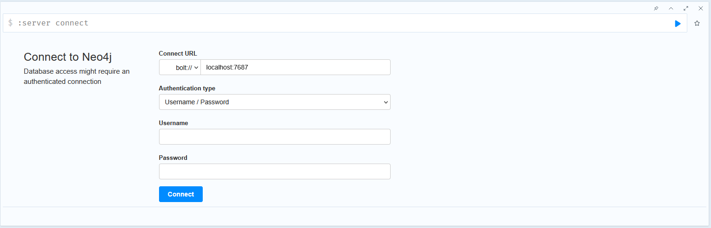<br>

Upon connecting you should see the following
<br><br>

Now that the Neo4J database is configuired lets launch Redis! 

## Redis
The Redis database is our caching database primarily for our SQL queries. The following steps will help you deploy a StatefulSet of 6 pods, where the first is designated as our controller.
### 1) Deploy the Redis k8s objects
```
# Deploy the Redis CephFS Storage Pool
kubectl create -f infra/redis/redis-ceph.yaml

# Deploy the redis configMap
kubectl apply -f infra/redis/redis-configmap.yaml

# Deploy the redis service and stateful set
kubectl apply -f infra/redis/redis.yaml
```
Next, we will move onto Jupyter Lab where we have Notebooks to handle the data imports. We can head back to the Neo4J web interface or Datagrip if we want to debug queries directly in those environments, otherwise you can now stop the port-forwarding of those pods, do not worry! The service is still running and our pods will all be able to communicate with one another to access the database.

## Jupyter Lab 
The Jupyter Lab Collaborative instance allows multiple team members to work on a single code base. Though Datagrip for Postgres and the Neo4J interface were both used for debugging queries, the majority of our development took place in the Jupyter Lab Collaborative environment. Lets deploy the instance and ensure our code base is available!

### 1) Launch the JupyterLab K8's objects
```
# Lets launch the credentials secret first
# This sets the credentials that will be used to login to the jupyterlab instance. The username and password have been encrypted.
# The credentials are as follows: cinescope/cine$c0pe

# Launch the Secret
kubectl create -f infra/jupyter/jupyter-credentials.yaml

# Launch the JupyterLab configMap
kubectl apply -f infra/jupyter/jupyter-config.yaml

# Now lets launch JupyterLab
kubectl apply -f infra/jupyter/jupyter.yaml
```
### 2) Port forward and connect
Once your pods are created we will again port-forward to our local browser and here we will do the majority of our work. 
```
# Port Forward the jupyterlab pod
kubectl port-forward $(kubectl get pods -lapp=jupyterlab --output jsonpath='{.items[0].metadata.name}') 8888:8888
```
<br>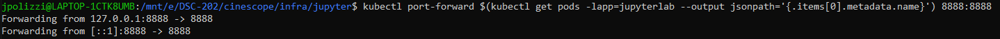<br>
Now, in your web browser navigate to: <br>
localhost:8888

You will now see the jupyterlab login page. Use the password specified above and you will be able to login
<br>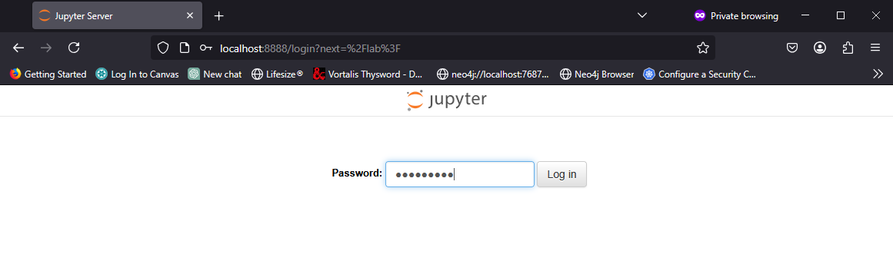<br>

On the left hand pane you will be placed into the /work/cinescope directory. The entire project code from Github will be present since we have previously cloned the project into the CephFS partition that is shared across the pods. 
<br><br> 

Navigate to the jupyter-code directory and open the neo4j-import.ipynb file.
<br><br>

This notebook will import the csv datasets into the Neo4J server. The cells have the following functions:
- Establish the connection to neo4j using the bolt port we previously configuired (7687).
- Import genre nodes
- Import the Movie nodes and Genre Relationships
- Import Persons (actors, directors, producers)
- Create the ACTED\_IN relationship
- Create Indexes

Now lets proceed forward and run the example queries in the cinescope-db-connection.ipynb 
Open the notebook and run each cell to make SQL queries against the Postgres Database and Redis Database Cache
<br>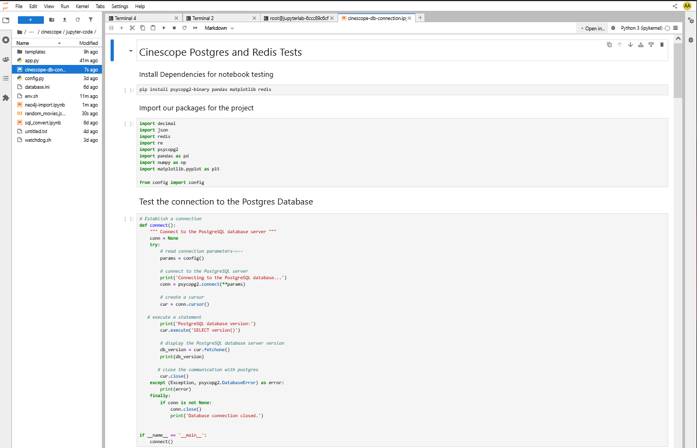

This notebook will run the following functions
- Install python packages
- Import python packages
- Test the Connection to the Postgres Database
- Run a basic query to return our SQL tables
- Run a query to print the postgres columns from a function input
- Test the redis connection
- test returning our genres with redis enabled
- test returning the genre\_id's with redis enablement
- Retrieve the languages and cache them to redis
- Run the top 5 movies per genre query
- Exploratory: Print graph of normalized votes
- Query the movie columns for specific films when a title is matched

There are 5 other files worth noting before we move on:
- cinescope/sql/genre-lookup.sql. As mentioned before, this is the main SQL query that drives our project. It is ingested by app.py updates the variables on every run of the Query with the users selections.
- the config.py file is used to authenticate with the database. It is used in the above cells for establishing a connection.
- The app.py file contains all of our flask front-end conversions. This file takes our final queries and allows them to be used in the front end
- The templates/index.html. This works as the tempalate alongside the app.py file and is our HTML output for the front end
- The watchdog.sh file is used by flask to loop and check for changes in the app.py files, file hash. This will relaunch the app.py file when a change is detected

Now we can move to the final deployment and launch our flask pods and access the front end. 

## Flask
Flask is the front end, this what connects the front-end to the back-end to create a database driven application
```
# Deploy the Flask Service to allow access on port 8080 in the pod
kubectl create -f infra/flask/flask-svc.yaml

# Launch ingress with HAProxy. our domain name is also configuired in this file
kubectl create -f infra/flask/flask-ingress.yaml

# Launch the Flask deployment
kubectl apply -f flask.yaml
```

Now the flask pods have been deployed.
Lets take a look at all our deployed resources
```
kubectl get all
```
The output will look similar to this:
<br>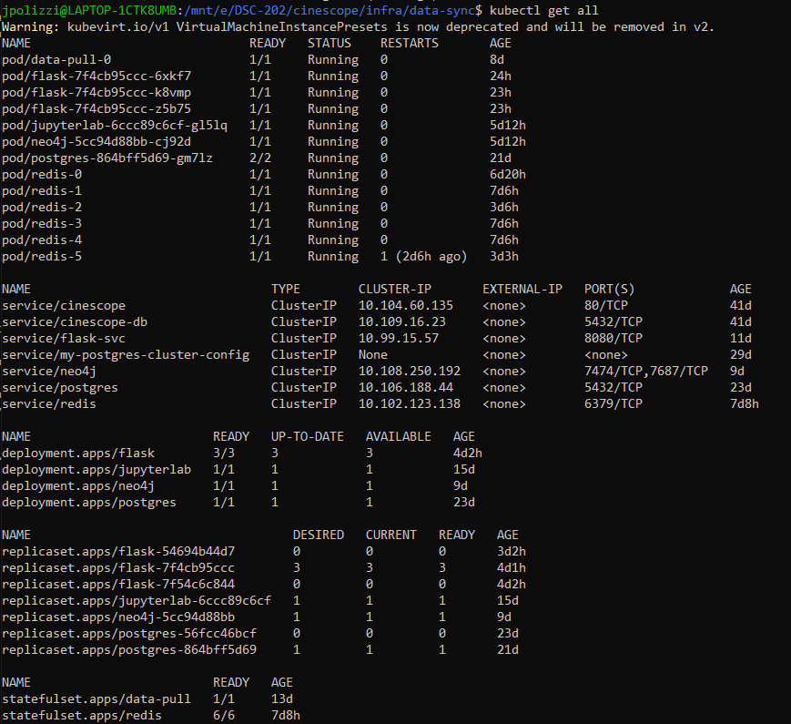<br>

## Explore Cinescope
Now all of our infrastructure, backend, databases, development environments, and front-end are up and running. Lets visit https://cinescope.nrp-nautilus.io and explore Cinescope.

### 1) Select a Genre and a Language
After navigating to the webpage you will see a drop down menu for genres and languages. Select a genre and a language then hit 'Submit' <br>
** Please note the majority of films are in 'English--United Kingdon'.
<br>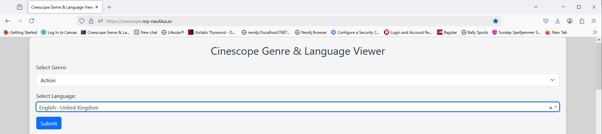<br>

If a cache hit is found for the combination then the query will be nice and fast, if a cache-miss occures then it may take several seconds for the query to update.
You will see a table similar to the following:
<br>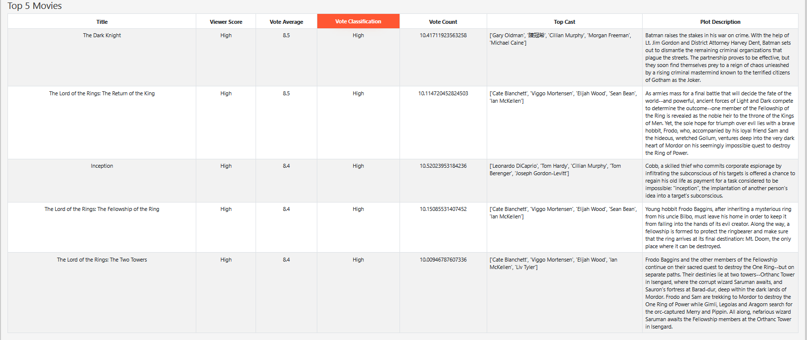<br>

### 2) Load the first Neo4J graph
Select load graph. This will take the five movies from the previous table and allow you to explore relationships connecting movies to genres and leading cast members to movies
<br>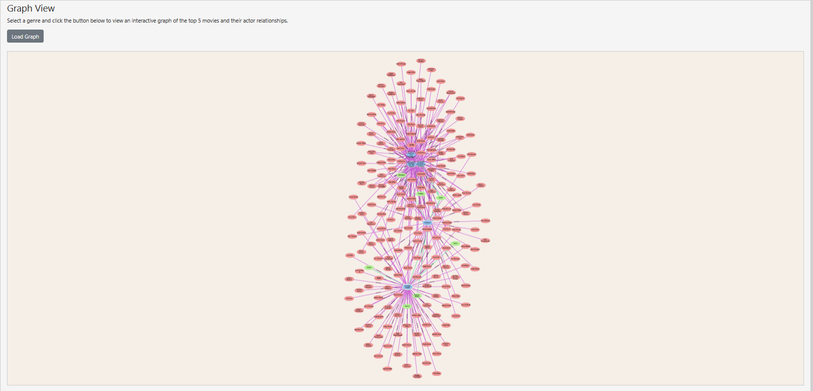<br>
<br>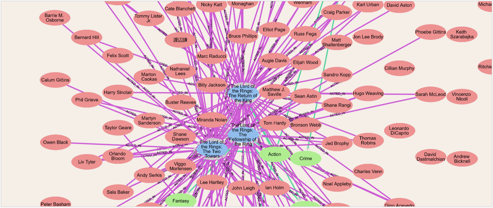<br>
<br>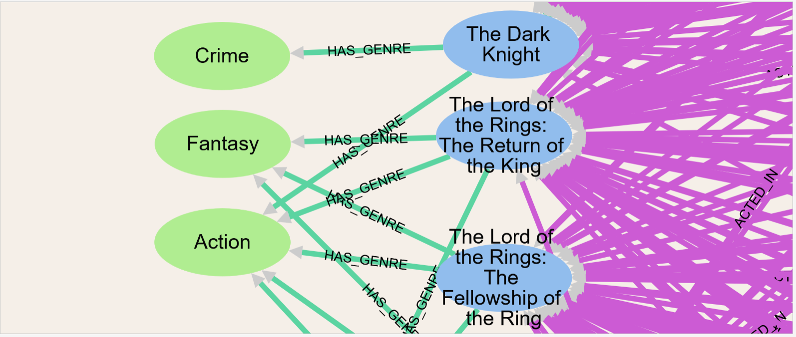<br>

### 3) View the Top Movie Genres and the Top Actors Per Genre Neo4J tables
The leader board of top genres and most popular actor per genre can be seen in the following tables
<br>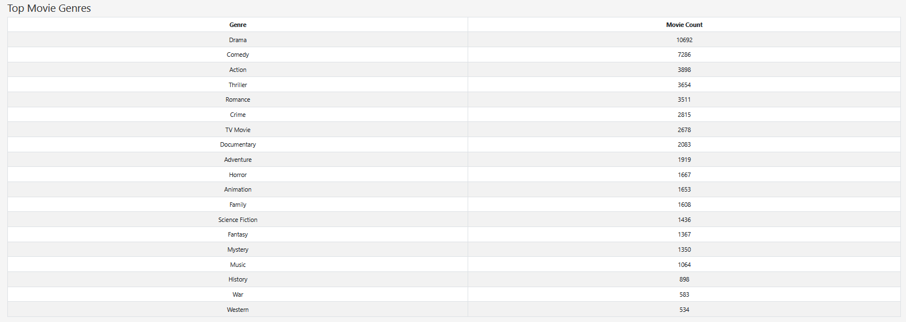<br>

<br>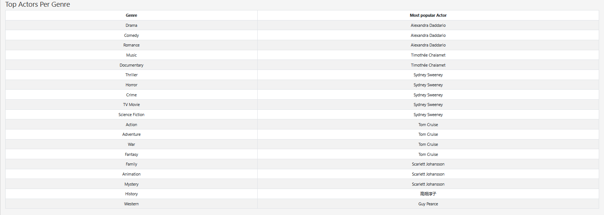<br>

### 4) Finally, lets view Actor relationships by Genre
The final graph shows actor relationships for actors who have been in more than one role together for the genre. 
<br>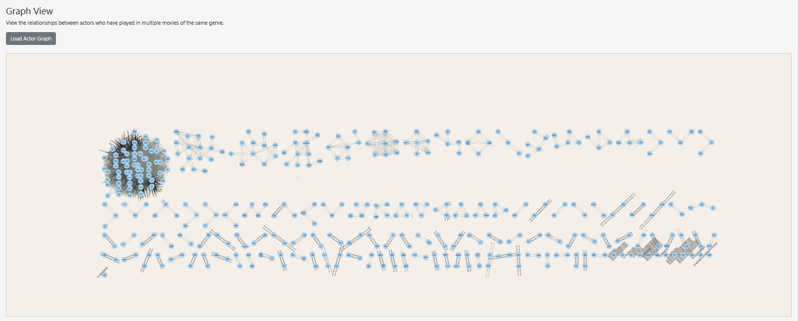
<br>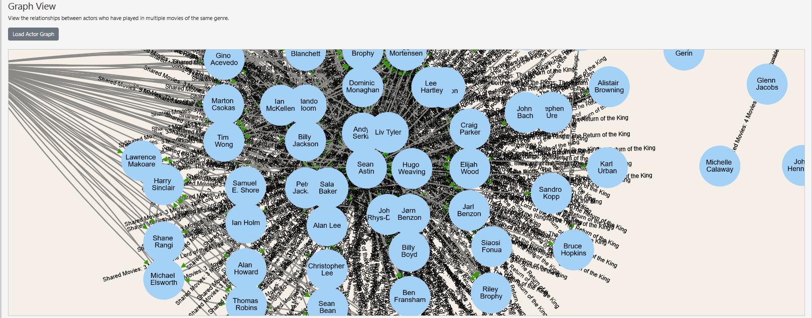
<br>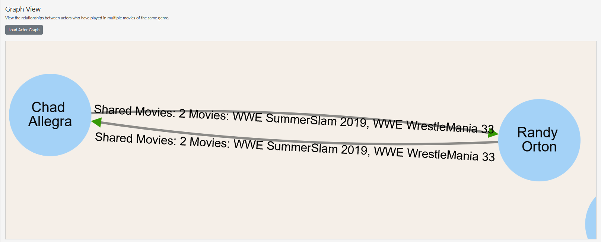
## Project Report
Report can be accessed here: [report/DSC\_202\_Cinescope\_Report.pdf](report/DSC_202_Cinescope_Report.pdf). Be sure to select "More pages" at the bottom of each page if you view the report in the Github interface.
## Slides
Slides used in the video presentation can be found here: [slides/DSC-202-Cinescope-Slides.pdf](slides/DSC-202-Cinescope-Slides.pdf)
